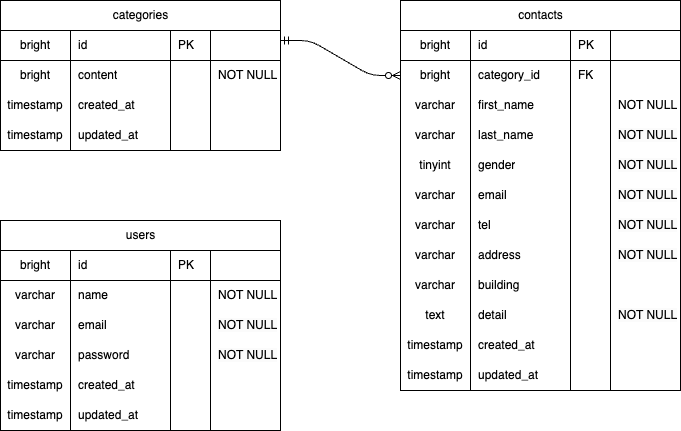

# お問い合わせフォーム

## 環境構築

### Dockerビルド

* git clone
* docker-compose up -d --build

### Laravel環境構築

* docker-compose exec php bash
* compposer install
* cp .env.example .env, 環境変数を以下のように変更
* php artisan key:generate
* php artisan migrate
* php artinsa db:seed

### 開発環境

* お問い合わせ画面：http://localhost
* ユーザー登録：http://localhost/register
* ログイン画面：http://localhost/login
* 管理画面：http://localhost/admin
* phpmyadmin：http://locaohost:8080

## 使用技術(実行環境)

* nginx 1.21.1
* PHP 8.1-fpm
* MYSQL 8.0.26
* Laravel 8.83.8
* Livewire 2.12.8

## ER図

